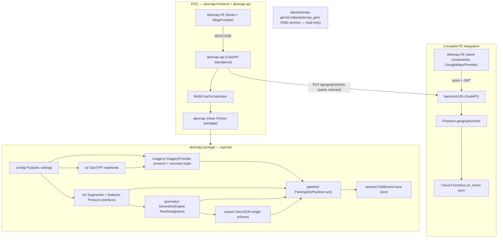
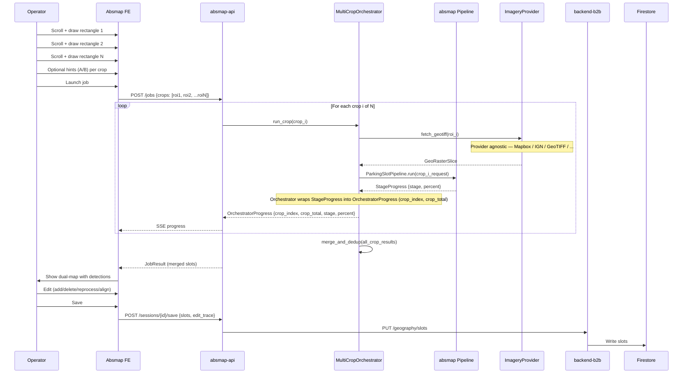

# Absmap — Modular Architecture

## Context & Constraints

- **Existing R&D pipeline** (`autocalib/absolutemap-gen/src/absolutemap_gen/`): kept as reference/archive. **Not imported by anything new.** A clean `absmap` package replaces it.
- **New clean package** (`autocalib/absmap/`): production-ready rewrite with layered architecture, Pydantic models, proper logging, injectable ML backends. This is what `absmap-api` imports.
- **Cocopilot-FE** (`Cocopilot-FE/src`): React 18 + TS + Vite + Redux Toolkit + Google Maps. Existing `absoluteMapInternal` page (to be replaced).
- **B2B API** (`user-interface-data-system/backend-b2b`): FastAPI, `POST/GET/PUT /geography/slots` → Firestore → Cloud Functions duplicate to `on_street/slots_static` + `slots_dynamic`. No change needed.
- **Goal**: POC fast with **Mapbox GL JS** as the display renderer, then swap to Google Maps on Cocopilot-FE integration. **Zero business logic rewrite.** The `IMapProvider` interface is the only renderer contract.
- **Imagery for ML**: completely separate from the display map. The `ImageryProvider` protocol (Mapbox Static, IGN WMTS, GeoTIFF, …) fetches high-resolution rasters on job launch — never tied to map scrolling.

---

## Architecture Diagram



---

## Module Breakdown

---

### 0. `absmap` — the clean Python package

**Location:** `autocalib/absmap/`

This is the **central rewrite**. The R&D archive (`absolutemap-gen/src/absolutemap_gen/`) is kept as reference but nothing new imports it. All ML, geometry, and export logic lives here.

**Why a rewrite (key R&D blockers found):**

- `config.py`: two sources of truth for detection thresholds; default IGN radius is 128 m in code, 32 m in comments; checkpoint path hardcoded under `artifacts/`
- `pipeline.py`: `print()` logging throughout; duplicate `_pixel_geom_to_wgs84` vs `export_geojson` version; `result_on_mask` parameter is dead code; no structured error handling mid-run
- `geometric_engine.py`: ~8 magic numbers (angles, IoU fractions, step counts) not configurable; synthetic spots incorrectly skew occupancy stats
- `export_geojson.py`: two incompatible GeoJSON schemas (pipeline v2 vs snapped v1); `write_geojson_feature_collection` is non-atomic; `snap_validate` import fails if module absent
- `artifacts_io.py`: Git subprocess in library code; duplicate `write_rgb_geotiff` name conflicts with `mapbox_static.write_rgb_geotiff` (different signatures)
- `ign_ortho.py`: SSL `CERT_NONE` fallback; no HTTP retry/backoff
- `detection.py`: `assert` in library hot path; `result_on_mask` ignored

**Parity validation — R&D → absmap rewrite:**

The rewrite is module-by-module, each validated against the R&D pipeline before moving on. A small golden-file suite (`tests/golden/`) captures R&D outputs on 5–10 representative GeoTIFFs before any rewrite begins.

| Order | Module | Parity check |
|---|---|---|
| 1 | `io/` (GeoTIFF read) | Byte-identical raster loads |
| 2 | `ml/segmentation` | Pixel-identical masks (same model, same input) |
| 3 | `ml/detection` | Identical YOLO outputs (same checkpoint) |
| 4 | `geometry/engine` | Golden-file comparison: slot count delta, matched-pair IoU, unmatched slots |
| 5 | `export/geojson` | Schema-identical GeoJSON output |
| 6 | `pipeline/runner` | End-to-end golden-file match |

Golden-file structure:

```
tests/golden/
  case_001/
    input.tif                     # or a reference pointer (large files not in git)
    segmentation_mask.npy         # R&D SegFormer output
    detections_raw.json           # R&D YOLO-OBB before GeometricEngine
    detections_post.json          # R&D after GeometricEngine (the one that matters)
    export.geojson                # R&D final GeoJSON
    meta.json                     # model versions, config, slot count
  case_002/
    ...
```

The comparison harness flags any case where slot count changes >5 % or mean matched-pair IoU drops below threshold. This is parity testing (old code vs new code), not accuracy benchmarking — no ground truth needed.

`GeometrySettings` defaults are extracted from the R&D `geometric_engine.py` values before rewriting, so the clean code starts with identical behavior.

During the rewrite period, `absolutemap-gen` stays runnable as a shadow pipeline: if an operator reports odd results, re-run the same input through R&D and diff.

**Layered structure (each layer only imports from layers above it):**

```
autocalib/absmap/
  __init__.py
  config/
    __init__.py
    settings.py          # Pydantic BaseSettings: SegFormer, YOLO, imagery, pipeline, geometry
  io/
    __init__.py
    geotiff.py           # GeoRasterSlice (pixels + crs_epsg + affine + gsd_m), read/crop
    atomic.py            # write_json_atomic, write_geotiff (single impl, no duplicates)
  imagery/
    __init__.py
    protocols.py         # ImageryProvider protocol (fetch_geotiff(roi) → GeoRasterSlice)
    mapbox.py            # MapboxImageryProvider — adds retry/backoff, clean token handling
    ign.py               # IGNImageryProvider — removes SSL workaround for prod, documented fallback
  ml/
    __init__.py
    protocols.py         # Segmenter protocol, Detector protocol (injectable / testable)
    models.py            # SegmentationOutput, DetectionResult (Pydantic)
    segmentation.py      # SegFormerSegmenter implements Segmenter
    detection.py         # YoloObbDetector implements Detector — removes dead param, fixes assert
  geometry/
    __init__.py
    models.py            # PixelSlot, SlotSource enum — Pydantic, single source of truth
    engine.py            # GeometricEngine — magic numbers → named fields in GeometrySettings
    straightener.py      # RowStraightener — directed corridor walk (see algorithm below)
    postprocess.py       # mask morphology/simplify — extracted from segmentation.py
  export/
    __init__.py
    models.py            # GeoSlot (Pydantic) — WGS84 slot with provenance fields
    geojson.py           # single GeoJSON schema v1, atomic write
  pipeline/
    __init__.py
    models.py            # PipelineRequest, PipelineResult, StageProgress (Pydantic)
    runner.py            # ParkingSlotPipeline(imagery, segmenter, detector).run(request) → PipelineResult
    stages.py            # pure functions: fetch_imagery, segment, detect, enrich, export
  session/
    __init__.py
    models.py            # EditEvent, SessionTrace, DifficultyTag (Pydantic)
    store.py             # SessionStore.save(trace) — filesystem for POC, swappable for Firestore
  pyproject.toml
```

**Key design rules:**

- Every module uses `logging.getLogger(__name__)` — zero `print()` calls
- All data crossing a layer boundary is a **Pydantic model** (validated, serializable, documented)
- `Segmenter`, `Detector`, and `ImageryProvider` are **Protocols** — `ParkingSlotPipeline` is fully agnostic about imagery source, ML backends, and hardware; 
- **The pipeline has no concept of "Mapbox" or "IGN"**: the concrete `ImageryProvider` is injected at construction — `ParkingSlotPipeline(imagery=provider, segmenter=..., detector=...)`. Adding a new imagery source (Google, GeoTIFF file, S3 bucket…) requires zero changes to the pipeline
- `GeometrySettings` exposes all tunable numbers: `angle_tolerance_deg`, `dt_threshold_fraction`, `iou_dedup_threshold`, `max_gap_fill_steps`, etc.
- A single `GeoJSON schema v1` in `export/geojson.py` — no parallel schemas
- `ParkingSlotPipeline.run(request)` is the **only public entry point** for the API layer; it emits `StageProgress` events via a callback for SSE streaming

**`PipelineRequest` / `PipelineResult` — single crop, pure unit (Pydantic):**

```python
# ParkingSlotPipeline operates on ONE crop at a time.
# It knows nothing about which imagery provider fetches the raster,
# and nothing about the other crops in the job.
class PipelineRequest(BaseModel):
    roi: GeoJSONPolygon           # one rectangle drawn by the user
    hints: HintMasks | None = None

class StageProgress(BaseModel):
    # absmap package only knows about its own single crop run — no crop_index here.
    # The MultiCropOrchestrator in absmap-api wraps this into an OrchestratorProgress
    # that adds crop_index / crop_total before forwarding to SSE.
    stage: str                    # e.g. "fetch_imagery", "segment", "detect"
    percent: int                  # 0–100 within this crop

class PipelineResult(BaseModel):
    slots: list[GeoSlot]
    baseline_slots: list[GeoSlot] # snapshot before GeometricEngine (for learning loop diff)
    run_meta: RunMeta             # model versions, roi, gsd_m — no source coupling
```

**`JobRequest` / `JobResult` — multi-crop, owned by `absmap-api`:**

```python
# These models live in absmap-api, not in the absmap package.
# The API layer is responsible for orchestrating N crops and merging results.
class CropRequest(BaseModel):
    roi: GeoJSONPolygon
    hints: HintMasks | None = None

class JobRequest(BaseModel):
    crops: list[CropRequest]      # N rectangles drawn by the user while scrolling

class OrchestratorProgress(BaseModel):
    # absmap-api wrapper — adds crop context around the pure StageProgress from absmap
    crop_index: int               # which crop is currently running (0-based)
    crop_total: int               # total number of crops in this job
    stage: str                    # forwarded from StageProgress
    percent: int                  # forwarded from StageProgress

class JobResult(BaseModel):
    job_id: str
    slots: list[GeoSlot]          # merged + deduplicated across all crops
    baseline_slots: list[GeoSlot]
    crop_results: list[PipelineResult]  # per-crop detail (for debugging / learning loop)
```

**How imagery selection and multi-crop orchestration work in the service layer:**

```python
# absmap-api / services / pipeline_service.py

# The ImageryProvider is injected — the pipeline never knows which source is used.
# Provider choice is a config/environment decision, not an architecture decision.
provider = build_imagery_provider(settings)  # returns MapboxImageryProvider, IGNImageryProvider,
                                             # GeoTiffFileProvider, etc. — all implement the same Protocol

pipeline = ParkingSlotPipeline(
    imagery=provider,
    segmenter=SegFormerSegmenter(settings.segformer),
    detector=YoloObbDetector(settings.yolo),
)

# MultiCropOrchestrator loops over crops, streams progress, then merges
orchestrator = MultiCropOrchestrator(pipeline)
job_result = await orchestrator.run(job_request, on_progress=emit_sse)
```

---

### 0b. `RowStraightener` — algorithm

**Location:** `absmap/geometry/straightener.py`

The algorithm is a **directed corridor walk** with a rolling direction update. It handles both straight and gently curved rows without branching logic.

**Trigger (single-slot):** operator clicks one slot → `RowStraightener.straighten(reference_slot_id, all_slots)` → returns corrected `list[GeoSlot]`.

**Step 1 — Estimate local direction.**
From the reference slot, look at the 4–6 nearest neighbor slots (by centroid distance). Compute the **median angle** of these neighbors. This gives the initial corridor direction.

**Step 2 — Open a narrow corridor.**
Build an oriented bounding rectangle centered on the reference slot, aligned with the estimated direction. Width ≈ 1–1.5× slot width (one parking space). Extends in both directions from the reference.

**Step 3 — Walk the corridor in both directions.**
At each step, accept the next slot if:
- its centroid falls inside the corridor,
- its angle is compatible with the current direction (tolerance: a few degrees),
- spacing to the previous slot is consistent with the estimated pitch (from first 2–3 slots).

After each accepted slot, **update the corridor direction** with that slot's angle — this rolling update is what makes curved rows work without special-casing.

**Step 4 — Stop conditions.**
- No valid slot found within the corridor (gap too large)
- Angle breaks sharply (different row orientation)
- ~~Segmentation mask boundary reached~~ — **V1: not used.** The straightener operates only on the slot list; mask-based stop requires persisted masks per job/crop, which is not yet in the data path. To be revisited when per-crop masks are retained beyond the pipeline run.

**Step 5 — Apply correction.**
Once the full row is collected:
- **Orientation**: compute target angle (median of all row members), rotate each OBB to that angle
- **Alignment**: snap centroids onto the fitted row axis (removes side-to-side wobble); optionally smooth spacing along the row
- **Footprints**: slot width and length unchanged in V1 (only center + angle move)

**Edge cases (V1 behavior):**

| Case | V1 handling |
|---|---|
| Very short row (2–3 slots) | Straighten normally — median of 2–3 angles is still meaningful. Minimum row size: 2 slots. |
| Isolated slot (no neighbor in corridor) | Return empty list — no correction proposed. Operator sees nothing, no harm done. |
| T-intersection (two rows cross) | The corridor is narrow (1–1.5× slot width) and angle-filtered — it follows one row and ignores the perpendicular one. If the wrong row is picked, the operator cancels and clicks a slot in the other row. |
| Angled lot (multiple orientations) | Each straighten call discovers one row only. The operator clicks one slot per row orientation. No global "straighten all" in V1. |

**Curved rows — deferred to V2:**
~~After the walk, fit a smooth curve (polynomial or B-spline) through the collected centroids.~~ The B-spline/curve fitting adds significant complexity for a rare case. V1 applies the straight-line correction only (median angle + axis snap). Curved rows are handled by the operator making multiple straighten calls on subsections, or manual edits. Revisit when real usage data shows how often curved rows appear.

```python
class RowStraightener:
    def straighten(
        self,
        reference_slot_id: str,
        all_slots: list[GeoSlot],
    ) -> list[GeoSlot]:
        """
        Discover row from reference_slot_id via directed corridor walk,
        then return corrected GeoSlots (angle + centroid adjusted).
        Width/length of each slot unchanged.
        """
```

The result is returned as **proposed** slots — the API layer sends them back as `proposed_slots[]`. The frontend shows a preview; the operator confirms or cancels. On confirm, the Redux slice dispatches `applyAlignment`, which appends an `align` `EditEvent` to `editHistory`.

---

### 1. `absmap-api` — FastAPI standalone service

**Location:** `autocalib/absmap-api/`

Thin HTTP wrapper over `absmap.pipeline`. **No ML logic lives here** — it only manages job lifecycle and SSE streaming.

**Endpoints:**

- `POST /api/v1/jobs` — submit `crops: [{roi, hints?}, ...]` → returns `job_id`
- `GET /api/v1/jobs/{job_id}` — poll status: `pending | running | done | failed`, current `{crop_index, crop_total, stage, percent}`
- `GET /api/v1/jobs/{job_id}/result` — merged GeoJSON FeatureCollection + per-crop detail
- `POST /api/v1/jobs/{job_id}/reprocess` — reference slot + scope polygon → proposed slots
- `POST /api/v1/jobs/{job_id}/straighten` — one `slot_id` → row discovery + corrected geometries
- `POST /api/v1/sessions/{session_id}/save` — final slots + edit trace + difficulty tags → forwards to `PUT /geography/slots` on B2B

**Key data contracts (TypeScript — shared across POC and Cocopilot-FE):**

```typescript
// The frontend sends N crops (rectangles drawn while scrolling the parking lot).
// No imagery_source: the API service decides which provider to use from its own config.
interface CropRequest {
  polygon: GeoJSON.Polygon;           // one rectangle drawn by the user
  hints?: { class_a?: GeoJSON.Polygon; class_b?: GeoJSON.Polygon };
}

interface JobRequest {
  crops: CropRequest[];               // N rectangles — one per scroll zone
}

interface Slot {
  slot_id: string;
  center: [number, number];           // [lng, lat]
  polygon: GeoJSON.Polygon;           // OBB corners
  source: 'yolo' | 'row_extension' | 'gap_fill' | 'mask_recovery' | 'manual' | 'auto_reprocess';
  confidence: number;
  status: 'empty' | 'occupied' | 'unknown';
}

interface EditEvent {
  type: 'add' | 'delete' | 'bulk_delete' | 'modify' | 'reprocess' | 'align';
  timestamp: number;
  slot_ids: string[];
  before: Slot[];
  after: Slot[];
}

interface PipelineJob {
  id: string;
  status: 'pending' | 'running' | 'done' | 'failed';
  // OrchestratorProgress — assembled by absmap-api, not by the absmap package
  progress?: {
    crop_index: number;   // which crop is currently running (0-based), added by orchestrator
    crop_total: number;   // total crops in this job, added by orchestrator
    stage: string;        // forwarded from absmap StageProgress
    percent: number;      // forwarded from absmap StageProgress
  };
}
```

**File structure:**

```
absmap-api/
  app/
    main.py
    routes/
      jobs.py
      sessions.py
    services/
      pipeline_service.py       # builds ImageryProvider + ParkingSlotPipeline from config
      orchestrator.py           # MultiCropOrchestrator: loop crops → merge → deduplicate (see merge rule below)
      job_store.py              # in-memory dict for POC (swappable to Redis/Firestore)
      imagery_factory.py        # build_imagery_provider(settings) — returns correct impl
  requirements.txt
  Dockerfile
```

**Merge rule (rare case — overlapping crops):**

In practice crops rarely overlap: the operator draws adjacent rectangles while scrolling. But when two crops do overlap, the orchestrator must not produce duplicate slots. The rule is simple:

1. Process crops in draw order (first drawn = first processed).
2. After each crop, add its slots to a running result list.
3. Before adding a slot from crop N, check IoU against all existing slots in the result list. If IoU > `merge_iou_threshold` (default 0.5) with any existing slot, **keep the existing one and discard the new one** (first-crop-wins).
4. No averaging, no confidence tie-break — the operator will correct anything wrong in the editing phase anyway.

This keeps the logic trivial and predictable. Edge-case slots at crop boundaries may be slightly mispositioned; the operator sees them and nudges if needed.

> Models (ROI, Slot, EditEvent, PipelineJob) are imported directly from `absmap` — no duplication.

---

### 1b. Imagery strategy — two separate systems

There are two image systems in play. They are **completely independent**:

| | Display map | ML raster |
|---|---|---|
| **What** | Background tiles for the user to navigate | High-res aerial image fed to the pipeline |
| **Who fetches** | Map renderer (browser, natively) | `ImageryProvider` (server-side, on job launch) |
| **When** | Continuously as the user scrolls/pans | Once per crop, when the user launches the job |
| **Format** | XYZ/WMTS tiles (PNG) | GeoTIFF in memory (`GeoRasterSlice`) |
| **Agnosticism** | `IMapProvider` interface | `ImageryProvider` Protocol |

The `ImageryProvider` protocol in `absmap/imagery/protocols.py`:

```python
class ImageryProvider(Protocol):
    def fetch_geotiff(self, roi: GeoJSONPolygon, target_gsd_m: float) -> GeoRasterSlice:
        """
        Fetch a high-resolution raster for the given ROI.
        - roi is in WGS84 (EPSG:4326).
        - The provider reprojects to its native metric CRS internally.
        - Concrete implementations may subdivide the ROI into tiles and stitch them —
          the pipeline always receives a single GeoRasterSlice.
        - target_gsd_m is a hint (e.g. 0.15 for Mapbox, 0.20 for IGN);
          actual GSD is in the returned GeoRasterSlice.gsd_m.
        """
        ...
```

Concrete providers (all implementing the same protocol, all injectible):

```
absmap/imagery/
  protocols.py           # ImageryProvider Protocol
  mapbox.py              # MapboxImageryProvider — Static API, tiles → mosaic if ROI large
  ign.py                 # IGNImageryProvider    — WMTS tiles, no SSL workaround in prod
  geotiff_file.py        # GeoTiffFileProvider   — local file, for offline testing / replay
```

**Adding a new provider** (Google Aerial, S3 bucket, …) requires zero changes to the pipeline or the API orchestrator — only a new file in `absmap/imagery/` and a line in `imagery_factory.py`.

---

### 1c. CRS convention and pixel ↔ world alignment

Three coordinate systems coexist at runtime. Each has a clear role; the boundaries between them must be enforced, not assumed.

| Layer | CRS | Why |
|---|---|---|
| **Frontend / API contracts** | WGS84 (EPSG:4326, degrees) | GeoJSON standard, map renderers expect it |
| **ML raster (internal)** | Metric projection — provider-native (Web Mercator EPSG:3857 for Mapbox, Lambert-93 EPSG:2154 for IGN, UTM zone for others) | `gsd_m` only makes sense in a metric CRS; keeps pixel ↔ metre relationship exact |
| **Pipeline geometry** | Same metric CRS as the raster | Segmentation masks, OBB pixel coords, and GeometricEngine all operate in pixel space derived from the raster's affine transform |

**Rules:**

1. **`GeoRasterSlice` carries its CRS explicitly.** The model stores the EPSG code and the affine transform (origin, pixel size, rotation). No implicit assumption.
2. **Reprojection happens at two well-defined gates:**
   - **Inbound:** the `ImageryProvider` receives the ROI in WGS84, reprojects it to its native CRS internally, fetches tiles, and returns a `GeoRasterSlice` in the provider's metric CRS.
   - **Outbound:** `export/geojson.py` converts pixel-space OBBs → WGS84 `GeoSlot` using the raster's affine + CRS→WGS84 transform. This is the **only** place where metric → WGS84 conversion happens for slot geometry.
3. **The pipeline never reprojects mid-run.** Between fetch and export, everything stays in pixel / metric space. No intermediate WGS84 round-trip (which would introduce floating-point drift).
4. **`gsd_m` is a target, not a guarantee.** The actual GSD comes from the returned raster's affine transform. The pipeline reads it from `GeoRasterSlice.gsd_m` (computed, not configured) so that downstream geometry is always consistent with the real pixel size.

**Updated `GeoRasterSlice` (in `absmap/io/geotiff.py`):**

```python
class GeoRasterSlice(BaseModel):
    pixels: np.ndarray                  # H × W × C (RGB or RGBA)
    crs_epsg: int                       # e.g. 3857, 2154, 32631
    affine: Affine                      # rasterio-style affine (origin + pixel size)
    bounds_native: BBox                 # bounding box in native CRS (metres)
    bounds_wgs84: BBox                  # bounding box in WGS84 (for API / display)
    gsd_m: float                        # actual ground sample distance (from affine, not from config)
```

**Updated `ImageryProvider` protocol:**

```python
class ImageryProvider(Protocol):
    def fetch_geotiff(self, roi: GeoJSONPolygon, target_gsd_m: float) -> GeoRasterSlice:
        """
        Fetch a high-resolution raster for the given ROI.
        - roi is in WGS84 (EPSG:4326).
        - The provider reprojects to its native metric CRS internally.
        - Returns a GeoRasterSlice whose crs_epsg and affine are authoritative.
        - target_gsd_m is a hint; actual GSD is in the returned slice.
        """
        ...
```

This guarantees that the display map (WGS84 tiles in the browser), the ML raster (metric pixels on the server), and the exported OBBs (WGS84 GeoJSON) stay aligned — with no silent drift from uncontrolled reprojection.

---

### 2. `absmap-frontend` — React + Vite (POC, Mapbox GL JS)

**Location:** `autocalib/absmap-frontend/`

**Key architectural decision:** All feature modules are **map-renderer agnostic**. They communicate with the map through an `IMapProvider` interface. POC uses **Mapbox GL JS** (`react-map-gl` + `mapbox-gl-draw`); integration swaps to `GoogleMapsMapProvider` — **zero business logic rewrite**. The app is simply called **absmap** in the UI.

Two display maps and one imagery system coexist:
- **Display map** (left + right panel): rendered by the concrete `IMapProvider` implementation, handles scrolling/panning via native tile loading.
- **ML imagery**: fetched by the `ImageryProvider` (server-side) only when the user launches a job — completely independent of map scrolling.

```typescript
// src/map/MapProvider.interface.ts
interface IMapProvider {
  syncWith(other: IMapProvider): void;
  addSlotLayer(slots: Slot[], opts: SlotLayerOptions): LayerHandle;
  updateSlotLayer(handle: LayerHandle, slots: Slot[]): void;
  removeLayer(handle: LayerHandle): void;
  // Multi-crop: user draws N rectangles while scrolling the parking lot
  enableMultiRectDraw(): Promise<GeoJSON.Polygon[]>;
  enableLassoDraw(): Promise<GeoJSON.Polygon>;
  enableFreehandDraw(hintClass: 'A' | 'B'): Promise<GeoJSON.Polygon>;
  fitBounds(bounds: BBox): void;
}
// POC:         MapboxGLMapProvider implements IMapProvider (react-map-gl + mapbox-gl-draw)
// Integration: GoogleMapsMapProvider implements IMapProvider
```

**Feature modules (each is a self-contained folder):**

| Module | Responsibility | Key components |
|---|---|---|
| `crops/` | Draw N rectangles while scrolling, manage crop list | `CropDrawer`, `CropList`, `CropPanel` |
| `hints/` | Freehand mask hints (class A/B) per crop | `HintLayer`, `HintToolbar` |
| `pipeline/` | Trigger multi-crop job, stream per-crop progress | `PipelineTrigger`, `JobStatus` |
| `dual-map/` | Two synchronized maps (display renderer agnostic) | `DualMapLayout`, `SyncController` |
| `slot-layer/` | Render OBBs + centroids on map | `SlotLayer`, `SlotTooltip` |
| `editing/` | Add/Delete/BulkDelete/Copy/Modify | `EditingToolbox`, `BulkSelector` (lasso) |
| `reprocessing/` | Reference slot + scope → auto-fill | `ReprocessPanel`, `ScopeDrawer` |
| `row-straightener/` | Click one slot → align row | `RowStraightener`, `RowPreview` |
| `session/` | Edit history (undo/redo), dirty flag | `useEditHistory` hook |
| `save/` | Difficulty tags + final save | `SavePanel`, `DifficultyPicker` |

**Redux slice — `absmap-slice.ts`:**

```typescript
interface AbsmapState {
  crops: CropRequest[];       // N rectangles drawn by the user (grows as user draws)
  job: PipelineJob | null;    // current job (multi-crop)
  slots: Slot[];              // merged result across all crops
  baselineSlots: Slot[];      // immutable snapshot for diff (learning loop)
  selection: string[];        // selected slot_ids
  editHistory: EditEvent[];   // full trace for learning loop
  editIndex: number;          // pointer for undo/redo
  isDirty: boolean;
}
```

**File structure:**

```
absmap-frontend/
  src/
    map/
      MapProvider.interface.ts
      MapboxGLMapProvider.ts     # POC: Mapbox GL JS via react-map-gl + mapbox-gl-draw
      GoogleMapsMapProvider.ts   # ready for Cocopilot-FE integration
    features/
      crops/
      hints/
      pipeline/
      dual-map/
      slot-layer/
      editing/
      reprocessing/
      row-straightener/
      session/
      save/
    store/
      absmap-slice.ts
      store.ts
    api/
      absmap-api.ts             # typed axios client for absmap-api
    App.tsx
  package.json
  vite.config.ts
```

---

### 2b. Existing slots display — step 1 of the user journey

The engineering doc is explicit: **"already-mapped areas stay visible so they are not reworked by mistake."**

When the operator loads the tool, existing validated slots from Firestore must be rendered on the map immediately — before any crop is drawn. This is a read-only overlay, not part of the current editing session.

**Data flow on load:**

```
App mount
  → GET /geography/slots?bbox={viewport_bbox}   (B2B API or absmap-api proxy)
  → [GeoSlot[]] existing slots from Firestore
  → dispatch(setExistingSlots(slots))
  → IMapProvider.addSlotLayer(slots, { style: 'existing', interactive: false })
```

This adds `existingSlots: Slot[]` to the Redux slice (read-only, never part of `editHistory`):

```typescript
interface AbsmapState {
  existingSlots: Slot[];      // loaded on mount — read-only reference overlay
  crops: CropRequest[];
  job: PipelineJob | null;
  slots: Slot[];              // current session result
  // …
}
```

The display layer for existing slots uses a visually distinct style (muted color, no edit handles) so the operator can clearly differentiate them from the current session's detections.

**Contract notes:**
- The `GET /geography/slots` endpoint must match the real B2B contract (JWT auth, pagination via `?limit=` + `?offset=` or cursor, max features per response).
- **Overlap rule on save:** existing slots that fall inside a session's crop ROIs are **replaced** by the session's final slots (the operator has reviewed that zone). Slots outside the crop ROIs are untouched. This avoids duplicates without requiring global dedup.

---

### 3. Cocopilot-FE integration (later phase)

- **Replace** `src/pages/absoluteMapInternal/` with `src/pages/absmap/`
- Copy `absmap-frontend/src/features/` into `Cocopilot-FE/src/features/absmap/`
- Instantiate `GoogleMapsMapProvider` instead of the POC renderer — all feature modules untouched
- Add `absmap-slice` to the existing Redux store
- Add `absmap-api.ts` to `src/api/`, pointing at the deployed `absmap-api` service URL
- Keep the existing `PUT /geography/slots` save path through `backend-b2b` — no B2B changes needed

---

## Learning Loop Persistence

The engineering doc is explicit: "None of the learning signal is throwaway UI state — it must land in stable storage tied to ROI, model versions, and operator session metadata."

Four distinct steps make up the loop:

1. **Automated baseline run** — pipeline produces raw outputs (segmentation, detection, post-processing)
2. **Fast human refinement** — operator adds, deletes, modifies, reprocesses, aligns
3. **Structured capture and persistence** — separate layers stored durably, not just the final diff
4. **Offline CV improvement + revalidation** — retrain on the captured signal, then benchmark before promotion

---

### Session storage layout

The session is stored per-job, with separate layers for each stage of the pipeline. This enables per-layer CV analysis (SegFormer signals vs YOLO-OBB signals are distinct).

**Retention policy:** session artifacts (masks, GeoTIFFs, `.npy`) are stored on the VM's local disk. After each monthly retraining cycle, processed sessions are purged. Only lightweight outputs (`final_output.geojson`, `edit_trace.ndjson`, `delta_summary.json`) are kept long-term for KPI tracking.

```
sessions/{session_id}/
  run_meta.json                       # model versions, crops rois, gsd_m, imagery_provider,
                                      # session_start_iso, session_end_iso (for operator time KPI)
  crops_geometry.geojson              # all N rectangles drawn by the user

  per_crop/{crop_index}/
    segmentation_mask.npy             # raw SegFormer output (binary mask)
    detection_raw.geojson             # YOLO-OBB raw detections before GeometricEngine
    post_processed.geojson            # GeometricEngine output (the actual baseline)

  baseline_merged.geojson             # merged + deduped across all crops (before any edit)
  edit_trace.ndjson                   # timestamped operator events (one JSON per line):
                                      #   {type, timestamp_ms, slot_ids, before[], after[]}
                                      #   type: add | delete | bulk_delete | modify | reprocess | align
  reprocessed_steps.ndjson           # one entry per reprocess call:
                                      #   {trigger_slot_id, scope_polygon, proposed[], accepted[]}
  final_output.geojson                # validated operator truth (bbox + centroid / dot)

  difficulty_tags.json                # operator assessment — fixed list:
                                      #   occlusion | shadow | weak_ground_markings |
                                      #   visual_clutter | other (free text)
  delta_summary.json                  # computed on save:
                                      #   {additions, deletions, geometric_corrections,
                                      #    reprocess_calls, align_calls, operator_time_sec}
```

**Object lineage** — every `GeoSlot.source` field uses a fixed taxonomy, critical for per-path error analysis:

| `source` value | Meaning |
|---|---|
| `yolo` | Direct YOLO-OBB detection |
| `row_extension` | GeometricEngine row fill |
| `gap_fill` | GeometricEngine gap fill |
| `mask_recovery` | Recovered from segmentation mask |
| `auto_reprocess` | Produced by the Reprocessing Helper |
| `manual` | Placed by the operator (Add tool) |

---

### Session Pydantic models (`absmap/session/models.py`)

```python
class DifficultyTag(str, Enum):
    occlusion = "occlusion"
    shadow = "shadow"
    weak_ground_markings = "weak_ground_markings"
    visual_clutter = "visual_clutter"
    other = "other"

class DeltaSummary(BaseModel):
    additions: int
    deletions: int
    geometric_corrections: int
    reprocess_calls: int
    align_calls: int
    operator_time_sec: float          # session_end - session_start

class SessionTrace(BaseModel):
    session_id: str
    run_meta: RunMeta
    crops: list[GeoJSONPolygon]
    edit_events: list[EditEvent]      # full timestamped trace
    reprocessed_steps: list[ReprocessStep]
    final_slots: list[GeoSlot]
    difficulty_tags: list[DifficultyTag]
    other_difficulty_note: str | None
    delta: DeltaSummary
```

---

### CV improvement signals

The stored layers feed two separate CV improvement paths. They must be kept distinct — the learning signal for SegFormer is not the same as for YOLO-OBB.

#### SegFormer (segmentation)

| Signal | What it means |
|---|---|
| Manual additions in mask-excluded areas | False negative — segmentation missed this zone |
| Manual deletions in mask-included areas | False positive — segmentation over-covered |
| Difficulty tag `occlusion` / `shadow` | Hard-case curriculum for retraining |
| `final_output.geojson` geometry | Corrected mask targets (pseudo-mask) for retraining |

#### YOLO-OBB (detection)

| Signal | What it means |
|---|---|
| Manual additions (`source: manual`) | Missed detection (FN) |
| Manual deletions | False detection (FP) and hard negatives |
| Manual geometry edits (center/angle/size) | OBB regression correction targets |
| `source` attribution | Error localization by generation path (e.g. `row_extension` failing more than `yolo` → geometry bug, not model bug) |

---

### KPI framework

**Primary KPI — manual effort reduction** (the only promotion criterion that counts):

$$\text{effort} = \text{additions} + \text{deletions} + \text{geometric\_corrections} + \text{reprocess\_calls} + \text{align\_calls}$$

Lower is better. If a new model bundle does not reduce this number on the held-out set, it is not promoted.

**Secondary KPIs** (required for operational reporting, computed from `delta_summary.json`):

| KPI | Source field | Direction |
|---|---|---|
| Useful detection rate before editing | `1 - deletions / total_baseline_slots` | Higher is better |
| False positive rate | `deletions / total_baseline_slots` | Lower is better |
| False negative rate | `additions / total_final_slots` | Lower is better |
| Geometric correction rate | `geometric_corrections / total_final_slots` | Lower is better |
| Operator time per session | `operator_time_sec` | Lower is better |

---

### Model revalidation workflow

Before any model bundle is promoted to production:

1. **Retest on historical sessions** — run the candidate model on the same `crops_geometry` + `imagery_provider` conditions as past corrected sessions
2. **Compare outputs** against `baseline_merged.geojson` (old model) and `final_output.geojson` (operator truth)
3. **Compute KPI delta** — old model vs candidate on all secondary KPIs
4. **Publish benchmark report** — one report per candidate bundle with product + CV metrics

**Promotion rule (go / no-go):**
- Promote only if the **primary KPI** (manual effort) shows a net reduction
- And **no secondary KPI** shows a major operational regression
- If not met: keep current production bundle, continue the loop

---

## Monorepo layout (autocalib)

```
autocalib/
  absmap/                   # NEW: clean Python package (the core engine)
  absmap-api/               # NEW: FastAPI service (imports absmap)
  absmap-frontend/          # NEW: React POC (Mapbox GL JS)
  tests/golden/             # NEW: R&D golden outputs for parity validation (see section 0)
  absolutemap-gen/          # EXISTING: R&D archive — read-only reference (shadow pipeline during rewrite)
    src/absolutemap_gen/    #   original R&D code (not imported by new code)
    segformer/              #   SegFormer training scripts
    webapp/                 #   original Flask viewer
    docs/
    tests/
```

**Rule:** nothing outside `absolutemap-gen/` ever imports from `absolutemap_gen`. The R&D archive is a reference, not a dependency.

---

## Future modules — extensibility constraints

Two modules will follow absmap in the autocalib system:

- **`calib-gen`** — generate calibration bboxes on camera images (given a camera view of a parking lot, produce the bboxes that correspond to each slot as seen by that camera)
- **`pairing`** — couple each detected absolute map slot (`GeoSlot`) with its corresponding camera bbox from calib-gen (the core of autocalib: matching geo space ↔ camera image space)

These are **not designed here**, but the current architecture must not block them. Three explicit constraints are baked in:

### 1. `slot_id` — minimal contract for the CV/AI layer

The `absmap` package has one obligation: every `GeoSlot` it produces carries a `slot_id` (UUID v4), present in the GeoJSON export and every API response.

```python
class GeoSlot(BaseModel):
    slot_id: str              # UUID v4 — generated by the pipeline
    center: LngLat
    polygon: GeoJSONPolygon
    source: SlotSource
    confidence: float
    status: SlotStatus
```

That is the full responsibility of the CV/AI layer. `absmap` generates **ephemeral** UUIDs — they change on every run.

**Stable identity contract (owned by the save path, not by `absmap`):**

The B2B API / Firestore layer is responsible for **stable slot identity**. When the operator saves a session, the save path must:

1. **Match incoming slots to existing Firestore slots** by spatial proximity (centroid distance < threshold, e.g. 1 m) inside the session's crop ROIs.
2. **Reuse the Firestore `slot_id`** for matched slots. This stable key is what `calib-gen` and `pairing` will **read** downstream — they never generate IDs, only consume them.
3. **Assign a new Firestore `slot_id`** only for genuinely new slots (no spatial match).
4. **Delete Firestore slots** inside crop ROIs that have no match in the saved set (operator deleted them).

This logic lives entirely in `POST /sessions/{id}/save` → `PUT /geography/slots`. Zero changes to `absmap` needed — it keeps producing ephemeral UUIDs, and the save path reconciles them into stable Firestore keys.

### 2. `absmap` models are importable upstream — no circular deps

`calib-gen` and `pairing` will need to import `absmap.export.models.GeoSlot` as a dependency. The dependency direction must stay:

```
absmap  ←  calib-gen  ←  pairing
```

`absmap` never imports from `calib-gen` or `pairing`. This is already enforced by the layered structure — `absmap` has no knowledge of cameras or calibration.

### 3. Monorepo layout anticipates three siblings

```
autocalib/
  absmap/           # geo slot generation (current)
  absmap-api/       # HTTP service for absmap
  absmap-frontend/  # React POC for absmap
  calib-gen/        # future: camera bbox generation
  pairing/          # future: geo slot ↔ camera bbox matching
  absolutemap-gen/  # R&D archive
```

Each future package will follow the same pattern: a clean Python package + a FastAPI service + frontend feature modules plugged into the same `IMapProvider` / Redux slice pattern. No structural changes to `absmap` are needed to accommodate them.

---

## Integration sequence


