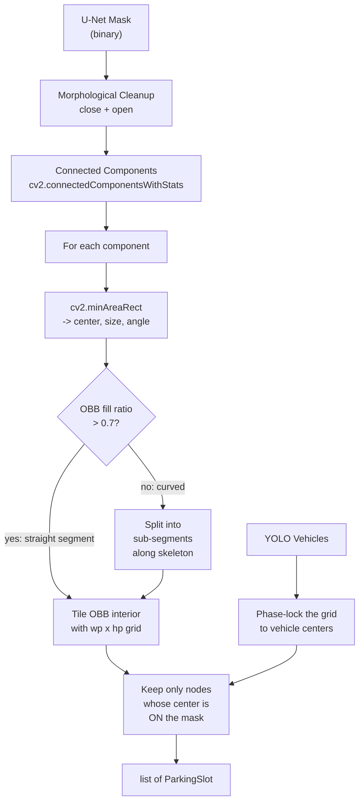
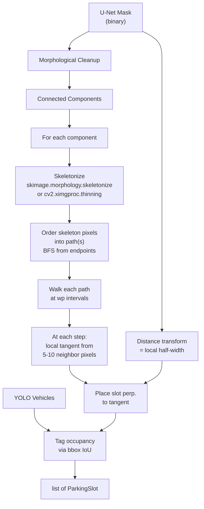
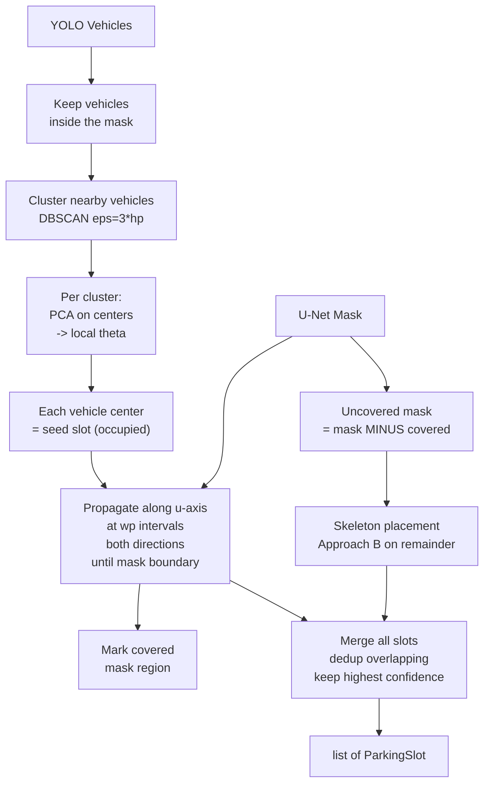
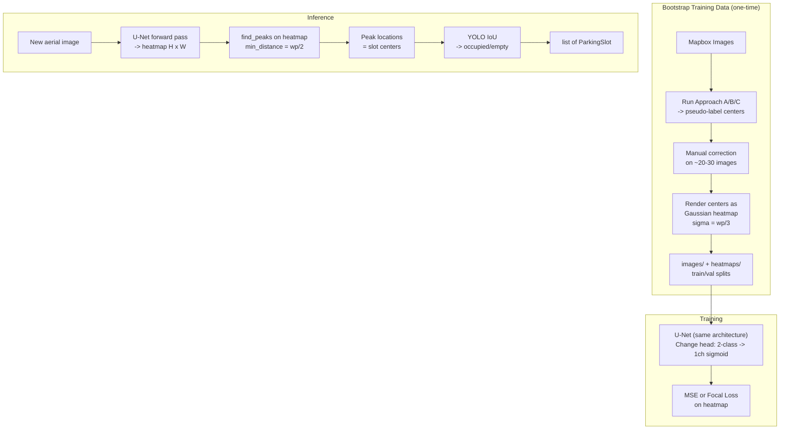
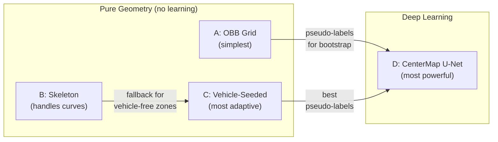

# Parking Slot Center Extraction -- Four Approaches

> Four approaches to find the pixel center of every parking slot (occupied or empty) in aerial images, without relying on painted line markings. From pure geometry to deep learning. All code is written from scratch.

---

## The Problem

Given an aerial/satellite image of a parking area:

- **Input**: RGB image + U-Net binary parkable mask + YOLO vehicle bounding boxes
- **Output**: pixel center `(cx, cy)` of every parking slot, occupied or not
- **Constraint**: most slots have NO visible painted markings. Low occupancy (~20-40%). Mix of street-side parking (linear, curved) and open lots (rectangular blocks).

## What We Keep

- **YOLO vehicle detection** (`src/absolutemap_gen/detection.py`): `DetectionBox` with `x_min, y_min, x_max, y_max, confidence`. This works and is useful.
- **U-Net segmentation** (`tests/apklot_segmentation/predict_mapbox.py` + `model.py` + `train.py`): produces the parkable mask. The architecture and training infrastructure are reusable.
- **Stall dimension priors**: `wp ~ 2.5m` (width along the row), `hp ~ 5.0m` (perpendicular depth). Converted to pixels via GSD when known.

Everything else in `src/` (router, gridgen, snap_validate, vlm_filter, export) is considered legacy. We write new code from scratch.

## Shared Output Format

```python
@dataclass
class ParkingSlot:
    center_x_px: float       # column in the image
    center_y_px: float       # row in the image
    width_px: float           # along the row axis (wp)
    depth_px: float           # perpendicular depth (hp)
    theta_rad: float          # orientation of the row axis
    occupied: bool            # True if a vehicle overlaps the slot
    confidence: float         # detection reliability
    source: str               # "obb_grid" | "skeleton" | "vehicle_seed" | "centermap"
```

GPS conversion is a separate later step (rasterio affine + pyproj, trivial once pixel centers are known).

---

## Approach A -- Per-Component OBB Grid Tiling

**Core idea:** Each connected component of the U-Net mask roughly corresponds to one parking "column" or segment. We compute the oriented bounding box (OBB) of each component, then fill it with a regular grid of slot-sized cells.



### Detailed Steps

1. **Mask cleanup**: morphological close (fill small holes) then open (remove noise). Kernel size ~ 3-5px.
2. **Connected components**: `cv2.connectedComponentsWithStats`. Discard components smaller than one slot area (`wp * hp` in pixels).
3. **Per component**:
   - Compute OBB via `cv2.minAreaRect(contour)` --> gives `(center, (w, h), angle)`.
   - Orient so that `long_side >= short_side`. The long side direction = **row axis** (theta).
   - `n_cols = round(long_side / wp_px)`, `n_rows = round(short_side / hp_px)`. Clamp `n_rows` to 1 or 2 (a parking column is at most 2 rows deep, per Koutaki's geometric model).
   - Generate grid: for `i in range(n_cols)`, `j in range(n_rows)`, compute center = OBB_origin + `i * wp * u + j * hp * v` where `u, v` are the OBB axes.
   - **Vehicle phase-lock**: if any YOLO vehicles fall inside this component, shift the grid origin so that the nearest grid node aligns with a vehicle center. This anchors the grid to reality.
   - Keep only grid nodes whose center pixel is on the mask (`mask[row, col] > 0`).
4. **Occupancy**: for each slot, check if any vehicle bbox overlaps the slot footprint (IoU >= 0.05).

### Strengths

- Simplest approach. Can be implemented in ~100 lines of code.
- Each component gets its own orientation (no global theta).
- Vehicle phase-locking gives real alignment.
- Fast: no iterative algorithms.

### Weaknesses

- Fails on curved components (0014_fontaine_pajot, 0019_rue_moulin). The OBB of a curved mask is much larger than the mask itself, and the fill ratio drops.
- The "split into sub-segments" fallback for curved components is a workaround, not a clean solution.
- Assumes uniform slot size within each component.

---

## Approach B -- Skeleton-Based Slot Placement

**Core idea:** Compute the medial axis (skeleton) of each mask component. The skeleton is the "spine" of the parking zone. Walk along the spine at regular `wp` intervals, placing slots **perpendicular to the local tangent** at each step. Slot depth = local mask width at that point.



### Detailed Steps

1. **Cleanup + connected components**: same as Approach A.
2. **Skeletonize** each component:
   - Use `skimage.morphology.skeletonize` (Zhang-Suen thinning).
   - Prune short branches: remove skeleton branches shorter than `wp_px` (these are spurs from mask boundary irregularities). Pruning = iteratively remove endpoints whose branch length < threshold.
3. **Order skeleton into paths**:
   - Find branch points (pixels with 3+ skeleton neighbors) and endpoints (pixels with 1 neighbor).
   - Split the skeleton graph at branch points into separate path segments.
   - Order each segment's pixels by walking from one endpoint to the other (BFS).
4. **Walk each path at `wp` intervals**:
   - Interpolate the path to get evenly-spaced points at distance `wp_px`.
   - At each point, compute the **local tangent** from the surrounding 5-10 path points (finite differences or local PCA).
   - The slot's row axis = tangent direction. The slot faces perpendicular to it.
5. **Slot depth from distance transform**:
   - `cv2.distanceTransform(mask, cv2.DIST_L2, 5)` gives distance to nearest boundary at every pixel.
   - At the skeleton point, the distance transform value = half the local mask width.
   - If `2 * dt_value > 1.5 * hp_px`, place 2 rows (one on each side of the skeleton). Otherwise, place 1 row.
   - Slot depth = `min(hp_px, dt_value)` (constrained by the prior).
6. **Occupancy tagging**: same as Approach A.

### Strengths

- Naturally follows curved parking zones (the skeleton follows the curve).
- Each slot gets its own local orientation (continuous adaptation).
- The distance transform automatically determines 1-row vs. 2-row zones.
- Works with zero vehicles (purely mask-driven).

### Weaknesses

- Skeletonization is fragile: noisy mask boundaries create spurious branches. Pruning helps but is not perfect.
- The skeleton of a wide rectangular area (open lot) is a straight line in the middle, which works, but branching skeletons from irregular masks can be hard to order.
- Slower than Approach A due to skeletonization + path ordering.
- Requires `scikit-image` (or `cv2.ximgproc`).

---

## Approach C -- Vehicle-Seeded Row Propagation

**Core idea:** Use the ~20-40% of slots that contain a vehicle as reliable "seed" positions. From each seed, propagate in both directions along the row, placing empty slots at regular intervals until hitting the mask boundary. For mask regions with zero vehicles, fall back to Approach B's skeleton logic.



### Detailed Steps

1. **Filter vehicles to mask**: keep only YOLO detections whose center falls on `mask > 0`.
2. **Cluster vehicles**: DBSCAN clustering (`eps = 3 * hp_px`, `min_samples = 1`). Each cluster = one local parking area.
3. **Per cluster -- determine local orientation**:
   - If the cluster has >= 3 vehicles: PCA on their centers --> principal axis = row direction.
   - If the cluster has 1-2 vehicles: use the vehicle bbox aspect ratio. In aerial view, vehicles are typically aligned with the slot depth axis. The longer bbox dimension ~ `hp`, the shorter ~ `wp`. So `theta = atan2(bbox_h, bbox_w)` rotated by 90 degrees gives the row axis.
   - This gives a **local** theta per cluster (no global assumption).
4. **Propagation from each seed**:
   - From each vehicle center, step along `u = (cos theta, sin theta)` in both positive and negative directions.
   - At each step (distance = `wp_px`), check if the new center is on the mask.
   - If yes: create a new empty slot. Continue.
   - If no: stop propagating in that direction.
   - Also check the perpendicular direction: if `dt_value > hp_px` at the seed, create a parallel row at distance `hp_px` along `v`.
5. **Mark covered regions**: for each placed slot, mark a `wp x hp` rectangle as "covered" on a boolean map.
6. **Skeleton fallback**: for connected mask regions with no coverage, apply Approach B.
7. **Merge + dedup**: if two slots from different sources (propagation vs. skeleton, or two nearby clusters) overlap with IoU > 0.3, keep the one with higher confidence (vehicle seed = 1.0, propagated = 0.8, skeleton = 0.5).

### Strengths

- Vehicle-seeded slots are the most reliable (a parked car IS proof of a slot).
- Propagation fills entire rows from just 1-2 seed vehicles per row.
- Local orientation per cluster handles mixed-angle parking lots.
- Skeleton fallback ensures 100% mask coverage.
- Most adaptive to real-world conditions.

### Weaknesses

- Most complex to implement.
- If YOLO produces a false positive (e.g., a vehicle on a road, not a parking slot), it seeds a bad row. Mitigation: only use vehicles inside the mask.
- Propagation assumes constant `wp_px` spacing. In practice, stalls sometimes vary slightly.
- Merge logic between vehicle-seeded and skeleton regions can produce artifacts at boundaries.

---

## Approach D -- CenterMap U-Net (Direct Slot Center Prediction)

**Core idea:** Change what the neural network predicts. Instead of outputting "is this pixel parkable?" (a coarse blob), train the SAME U-Net architecture to produce a **heatmap where each parking slot center creates a Gaussian peak**. At inference, simply find the peaks.

This is the most powerful approach because the network learns the visual patterns of slot positions directly, handling all cases (curved, straight, occupied, empty, shadowed, irregular) without any handcrafted geometric rules.



### Phase 1: Bootstrap Training Data

1. Run Approach A (or B or C) on all existing Mapbox images to generate pseudo-label slot centers.
2. Manually review and correct the ~20-30 worst cases. Correction = click to add/remove/move centers. This is fast (~2 min per image).
3. For each image, render the corrected centers as a **Gaussian heatmap**:
   - For each center `(cx, cy)`: add a 2D Gaussian with `sigma = wp_px / 3`
   - Normalize to [0, 1]
   - Save as a single-channel grayscale PNG in a `heatmaps/` folder

### Phase 2: Modify and Train the U-Net

1. **Architecture change**: minimal modification to `tests/apklot_segmentation/model.py`:
   - Change `self.head = nn.Conv2d(f, num_classes, 1)` to `self.head = nn.Conv2d(f, 1, 1)` (single output channel)
   - Add `nn.Sigmoid()` after the head
   - Alternative: keep the 2-class head, but class 1 means "slot center" instead of "parkable area". This allows fine-tuning from the existing checkpoint.
2. **Loss function**: replace `CombinedLoss` with:
   - **MSE loss** on the heatmap (simple, works well for Gaussian targets)
   - OR **Focal loss** variant: weight the loss so that peaks matter more than background
3. **Dataset change**: adapt `tests/apklot_segmentation/dataset.py` to load `heatmaps/` instead of `masks/`. The `mask_transform` becomes a simple resize + float conversion (no thresholding).
4. **Training**: fine-tune from the existing APKLOT checkpoint (`train.py` already supports `--finetune`). The encoder has already learned to extract parking-relevant features; only the decoder and head need to learn the new task.

### Phase 3: Inference

1. Forward pass on new image -> heatmap of shape `(H, W)`, values in [0, 1].
2. **Peak detection**: `skimage.feature.peak_local_max(heatmap, min_distance=wp_px//2, threshold_abs=0.3)`.
3. Each peak `(row, col)` = a slot center in pixel coordinates.
4. Slot orientation: either use the heatmap gradient direction at each peak, or fall back to local PCA on nearby peaks.
5. Occupancy: YOLO IoU check.

### Resolution Consideration

The U-Net currently works at 256x256. At typical Mapbox zoom levels, this may be sufficient for image crops. If slots are too close together to resolve at 256x256, increase to 512x512 (the architecture handles arbitrary sizes). The parameter count stays the same (~1.8M) -- only the input resolution changes.

### Strengths

- The network LEARNS what slot positions look like from data, no handcrafted rules.
- Handles ALL cases: curved, straight, wide, narrow, regular, irregular, shadowed, occluded.
- Inference is trivial: one forward pass + peak finding.
- Scales naturally: more training data = better results.
- Reuses the existing U-Net architecture, dataset format, and training pipeline. The modification is minimal (~20 lines changed).
- Iteratively improvable: run inference, manually correct errors, add to training set, retrain.

### Weaknesses

- Requires a bootstrapping phase (generate pseudo-labels + manual correction). ~1-2 hours of one-time effort for 20-30 images.
- Peak detection parameters (sigma, threshold, min_distance) need tuning.
- At 256x256, very dense parking lots may have overlapping Gaussian peaks. Mitigation: use 512x512 or tiled inference.
- Less interpretable than geometric approaches (harder to debug failure cases).

---

## Synthesis: How the 4 Approaches Relate



- **A** is the fast baseline for rectangular parking lots. Implement first to validate the output pipeline.
- **B** provides the skeleton machinery needed by C, and handles curved masks.
- **C** combines A and B and produces the best geometric results. Its output bootstraps D.
- **D** is the end-game: once trained, it replaces A/B/C entirely for inference. But it needs them to generate initial training data.

## Recommended Implementation Order

1. **Shared infrastructure**: `ParkingSlot` dataclass, visualization overlay, GSD-to-pixel conversion
2. **Approach A**: ~100 lines, immediate results, validates the entire output chain
3. **Approach B**: ~200 lines, adds skeleton + distance transform, handles curves
4. **Approach C**: ~150 lines on top of B, adds vehicle seeding + propagation + merge
5. **Approach D**: ~50 lines of model/dataset changes, then training. Uses C's output as pseudo-labels.

All new code goes in `tests/apklot_segmentation/slot_extraction.py` (colocated with the existing U-Net prediction and training scripts, independent of the legacy `src/` pipeline).
