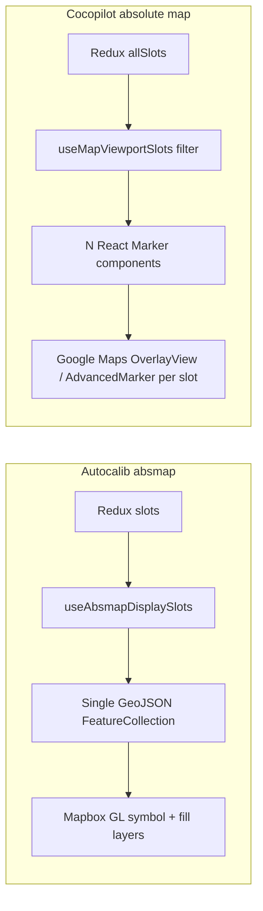

# Autocalib vs Cocopilot — Absolute Map Slot Rendering

Comparison of how parking slots are fetched and rendered on the absolute map in **Autocalib** (`absmap`) vs **Cocopilot-FE**, and why Autocalib feels much faster.

---

## Architecture overview



| Aspect | Autocalib | Cocopilot-FE |
|--------|-----------|--------------|
| Map library | Mapbox GL (`react-map-gl`) | Google Maps (`@vis.gl/react-google-maps`) |
| Slot representation | Single GeoJSON source | One React `<Marker>` per visible slot |
| Viewport culling | Mapbox GPU (internal) | `useMapViewportSlots` (JS filter) |
| Primary page | `autocalib-frontend/src/map/MapPanel.tsx` | `cocopilot-fe/src/pages/absoluteMap/absoluteMapSection/absoluteMapSection.tsx` |

---

## 1. Data fetching

### Autocalib

**Flow:** Redux → `useAbsmapDisplaySlots` → `resolveAbsmapDisplaySlots` → GeoJSON layers

| Step | Detail |
|------|--------|
| API | `GET /api/v1/clients/{id}/reference-slots` |
| Thunk | `loadClientSlots` in `autocalib-thunks.ts` |
| Storage | `b2bSnapshotAtLoad`, `baselineSlots`, `slots` in Redux |
| Geo filter | Optional `crop_lat`, `crop_lng`, `crop_radius_m` (500 m with ROI, 2500 m without) when no B2B client id |

**Key files:**
- `autocalib-frontend/src/api/autocalib-api.ts` — `fetchReferenceSlots`
- `autocalib-frontend/src/hooks/useAbsmapDisplaySlots.ts`
- `autocalib-frontend/src/utils/absmapDisplaySlots.ts` — `resolveAbsmapDisplaySlots`

Slots are fetched once, normalized in memory, and merged (workspace overrides prod/baseline). No per-marker data plumbing.

### Cocopilot-FE

**Flow:** Redux `allSlots` → `useMapViewportSlots` → `visibleSlots.map()` → N `<Marker>` components

| Step | Detail |
|------|--------|
| API | `GET /clients/{userId}/slots/map?check_event=false` (when `forMap: true`) |
| Action | `getAllParkingSlots` dispatched on mount |
| Storage | `state.parkingSlotsReducer.allSlots` |
| Geo filter | None server-side — full client dataset loaded upfront |

**Key files:**
- `cocopilot-fe/src/store/parking-slots-slice/api.ts`
- `cocopilot-fe/src/pages/absoluteMap/absoluteMapSection/absoluteMapSection.tsx`
- `cocopilot-fe/src/hooks/useMapViewportSlots.ts`

**Takeaway:** Data loading is similar (one bulk fetch). The performance gap is mostly in **rendering**, not API shape.

---

## 2. Rendering

### Autocalib — batch GPU rendering (Mapbox)

All slots are converted into **one GeoJSON `FeatureCollection`** and drawn with **two Mapbox layers**:

1. **Hit layer** — invisible polygon fill (`slots-hit-fill`) for click/hover
2. **Display layer** — symbol layer (`centroids-symbol`) for pin icons

```
Redux slots
    ↓
useAbsmapDisplaySlots()
    ↓
useAbsmapMapLayers()  →  centroidsGeoJSON + slotsHitGeoJSON
    ↓
MapPanel.tsx
    ├── Source "slots-hit"   → Layer fill (opacity 0.01)
    └── Source "centroids"   → Layer symbol (icon-image per slot_type)
```

**Why it's fast:**

- **No per-slot React component** — Mapbox draws all points in one GPU pass
- **Sprites preloaded once** via `registerSlotPinImages.ts`, shared across map instances
- **Viewport culling is internal** — pan/zoom does not remount React trees
- **Hover/selection** only change GeoJSON feature properties; structure stays one source
- **Hit testing** uses invisible polygons + `queryRenderedFeatures`, not DOM events per marker

**Key files:**
- `autocalib-frontend/src/map/useAbsmapMapLayers.ts`
- `autocalib-frontend/src/map/MapPanel.tsx`
- `autocalib-frontend/src/map/registerSlotPinImages.ts`
- `autocalib-frontend/src/map/useMapSlotPinLayers.ts`

### Cocopilot-FE — one React component per visible slot (Google Maps)

Filtered slots are mapped to individual `<Marker>` components:

```
allSlots (Redux)
    ↓
useMapViewportSlots()  →  viewport filter + throttle + chunked mount
    ↓
visibleSlots.map(slot => <Marker key={slot.slot_id} ... />)
    ↓
Per slot: AdvancedMarker OR LegacyHtmlMarker (OverlayView + createPortal)
```

**`useMapViewportSlots` optimizations** (helps, but cannot match Mapbox batch rendering):

| Constant | Value | Purpose |
|----------|-------|---------|
| `MARKERS_READY_DELAY_MS` | 300 | Defer marker mount until map is ready |
| `IDLE_THROTTLE_MS` | 300 | Throttle viewport updates on map `idle` |
| `CHUNK_THRESHOLD` | 600 | Below this: render all viewport markers at once |
| `CHUNK_SIZE` | 400 | Above threshold: progressive mount via `requestIdleCallback` |

**Each `Marker` resolves to a separate Google Maps overlay:**

| Mode | Component | Cost |
|------|-----------|------|
| Dark roadmap + custom marker | `LegacyHtmlMarker` | `google.maps.OverlayView` + `createPortal` **per slot** |
| Light / standard | `AdvancedHtmlMarker` | `AdvancedMarker` DOM node **per slot** |
| Dark roadmap + URL icon | `LegacyUrlMarker` | Classic `GmapsMarker` per slot |

The absolute map uses `preferJsonDarkRoadmap={true}` on `MapSection`, so in **dark roadmap** mode each slot gets the expensive `LegacyHtmlMarker` path.

**Key files:**
- `cocopilot-fe/src/hooks/useMapViewportSlots.ts`
- `cocopilot-fe/src/components/shared/marker/index.tsx`
- `cocopilot-fe/src/components/shared/mapSection/index.tsx`

---

## 3. Performance comparison

| Factor | Autocalib | Cocopilot-FE |
|--------|-----------|--------------|
| **Rendering model** | 1 GeoJSON → Mapbox GPU layers | N React `<Marker>` → N DOM overlays |
| **React components per 1000 slots** | ~2 (`Source` + `Layer`) | Up to 1000 (visible in viewport) |
| **Pan/zoom cost** | Mapbox repaints tiles/layers | `idle` → filter → `setState` → re-render markers |
| **Initial display delay** | Immediate once GeoJSON is ready | 300 ms before `markersReady` |
| **Large datasets (>600)** | All slots in one source; Mapbox culls | Chunked mount (400/chunk) — progressive but heavy |
| **Dark theme** | Mapbox style switch | `LegacyHtmlMarker` = OverlayView per slot |
| **Hover/selection** | Property change in one FeatureCollection | Full `visibleSlots.map()` rebuild in `useMemo` |

### Known Cocopilot pain point

From `useMapViewportSlots.ts`:

> *"Updates are throttled and skipped when the visible slot set is unchanged, to avoid idle → re-render → overlay → idle loops that peg CPU over time."*

Autocalib avoids this class of problem by not tying pan/zoom to React reconciliation.

---

## 4. Root cause summary

| | Autocalib | Cocopilot-FE |
|---|-----------|--------------|
| **Mental model** | Map as a **rendering engine** | Map as a **React component list** |
| **Slot = ** | One feature in GeoJSON | One React widget with its own overlay |
| **Pan/zoom** | GPU layer repaint | JS filter + state update + DOM reconciliation |

**Autocalib is fast because:**

1. Fetch once → normalize in Redux
2. Build one GeoJSON `FeatureCollection`
3. Let Mapbox draw all pins in a single symbol layer

**Cocopilot is slow because:**

1. Fetch all slots
2. Filter to viewport (good optimization)
3. Still mount hundreds of `Marker` components, each with its own Google overlay/DOM
4. Reconcile that tree on pan and on hover/selection state changes

---

## 5. Recommendations for Cocopilot (if aligning with Autocalib performance)

Ordered by impact:

### 1. Replace per-slot `Marker` on absmap (highest impact)

Use a **single data layer** instead of N overlays:

- Google Maps `FeatureLayer` / Data-driven styling, or
- deck.gl `IconLayer` / `ScatterplotLayer`, or
- Dedicated absmap with Mapbox (same approach as Autocalib)

### 2. Avoid `LegacyHtmlMarker` on slot-heavy maps

On absolute map pages with many slots:

- Set `preferJsonDarkRoadmap={false}`, or
- Use URL-based `LegacyUrlMarker` instead of custom DOM `customMarker` overlays

### 3. Decouple hover from `slotMarkers` useMemo

`displayedCocospot?.hoveredSlotId` in the dependency array rebuilds every marker on hover. Move hover styling into the marker component or a data layer expression.

### 4. Optional: server-side bbox filter

Autocalib can limit slots by crop radius. Cocopilot always loads the full client — consider a viewport or bbox query for very large clients.

### 5. Long term: deep-link to Autocalib for absmap editing

The integration plan (`autocalib/docs/cocopilot-integration-plan.md`) already treats Autocalib as the dedicated absmap tool, with Cocopilot linking out for staff workflows.

---

## 6. File reference

### Autocalib

| File | Role |
|------|------|
| `autocalib-frontend/src/map/MapPanel.tsx` | Mapbox map + layer definitions |
| `autocalib-frontend/src/map/useAbsmapMapLayers.ts` | GeoJSON builders for slots, crops, ghosts |
| `autocalib-frontend/src/hooks/useAbsmapDisplaySlots.ts` | Resolved slot list for display |
| `autocalib-frontend/src/utils/absmapDisplaySlots.ts` | Merge workspace + prod slots |
| `autocalib-frontend/src/store/autocalib-thunks.ts` | `loadClientSlots` |
| `autocalib-frontend/src/api/autocalib-api.ts` | `fetchReferenceSlots` |

### Cocopilot-FE

| File | Role |
|------|------|
| `src/pages/absoluteMap/absoluteMapSection/absoluteMapSection.tsx` | Absolute map page |
| `src/hooks/useMapViewportSlots.ts` | Viewport filter + chunked rendering |
| `src/components/shared/marker/index.tsx` | Per-slot overlay implementation |
| `src/components/shared/mapSection/index.tsx` | Google Maps wrapper + dark roadmap mode |
| `src/store/parking-slots-slice/api.ts` | `getAllParkingSlots` API |

---

*Generated from codebase comparison — Autocalib (`autocalib-frontend`) vs Cocopilot-FE (`../cocopilot-fe`).*