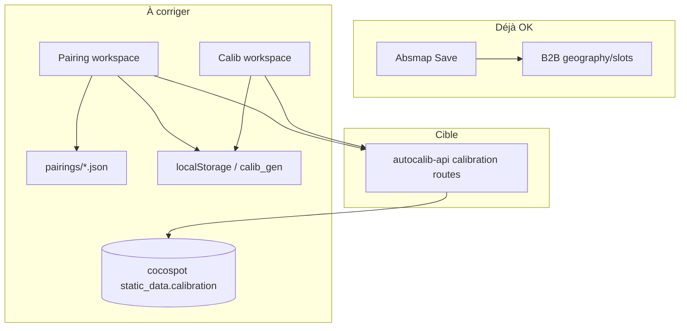

# Plan — Intégration Autocalib × Cocopilot (Niveau 1 : deep links)

> **Stratégie v1** : la VM héberge **tout** Autocalib (API + SPA). Cocopilot ajoute des **liens directs** vers la VM avec query params. Pas d’iframe, pas de bundle dans `public/autocalib/`, pas de réécriture API dans Cocopilot.

> **VM de référence** : [http://34.38.103.122:8000/absmap](http://34.38.103.122:8000/absmap) — stack Docker Compose sur `SELF_IMPROVING_YOLO_PIPELINE_VM`.

> **Hors scope v1** : iframe `/internal-autocalib`, embed shell, postMessage client, proxy same-origin, auth Firebase partagée.

> **Priorité données (nouveau)** : les **slots absmap** en B2B sont OK. Il faut aligner **calib** et **pairing** sur le doc **cocospot `static_data.calibration`** (même contrat que Cocopilot-FE), pas sur `pairings/*.json` ni le seul cache local / job `calib_gen`.

---

## Écart actuel — calib & pairing vs DB

| Donnée | Autocalib aujourd’hui | Cocopilot-FE (référence) | Cible |
|--------|----------------------|---------------------------|--------|
| **Slots carte (absmap)** | Save → `POST /clients/…/slots/sync` → sync **B2B** `geography/slots` | — | **OK** |
| **Calib bboxes** | Job `calib_gen` + **localStorage** ; pas de write DB | `POST /cocospots/{id}/static_data` avec `calibration.bboxes` | **Lire / écrire static_data** |
| **Pairing** | `pairings/{device}.json` + bboxes depuis **calib local** | Pairing **implicite** : clés de `bboxes` = `slot_id` + `calibration.slots` | Bboxes **depuis DB** ; save = même objet `calibration` |

### Contrat Cocopilot (à reproduire côté autocalib-api)

Sauvegarde calib dans [`Cocopilot-FE/.../calibration.tsx`](../../Cocopilot-FE/src/pages/single-cocospot/calibration/calibration.tsx) :

```typescript
POST /cocospots/{device_id}/static_data?reset=false|true
{
  calibration: {
    device_id,
    nb_slots,
    polygon,           // conserver l’existant si absent
    bboxes: Record<string, number[]>,  // clé = slot_id (string), valeur = coords % image
    slots: Record<string, { lat, lng, slot_type }>,
    front_marker,
    street_name,
  }
}
```

- **`bboxes`** : coordonnées **pourcentage** image (pas les pixels `calib_gen`).
- **Pairing métier** : une paire valide = même clé dans `bboxes` et entrée dans `slots` (géographie).

Autocalib utilise aujourd’hui `CalibBbox.spot_id: number` (détection) et `PairingLink { slotId, bboxSpotId }` — il faut un **adaptateur** bboxes DB ↔ `CalibBbox[]` et, à la sauvegarde, **clé = `slotId`** pour les paires confirmées.



---

## Phase C — Calib & pairing alignés DB (avant / en parallèle des deep links)

### C1 — Backend léger (`autocalib-api`)

| Route | Rôle |
|-------|------|
| `GET /api/v1/devices/{device_id}/calibration` | Proxy `GET {B2B}/cocospots/{id}/static_data` → `{ bboxes: CalibBbox[], slots, street_name, … }` |
| `POST /api/v1/devices/{device_id}/calibration` | Merge **comme Cocopilot** : convertit `CalibBbox[]` + slots pairés → `calibration.bboxes` + `calibration.slots` ; `reset=false` par défaut |
| `GET /api/v1/devices/{device_id}/calibration/image` | Optionnel : proxy `last_processed_image?draw=true` (carousel pairing) |

**Fichiers suggérés** :

- `app/services/cocospot_calibration.py` — httpx via `b2b_http`, read/write static_data
- `app/routes/calibration.py` — routes ci-dessus
- `app/models.py` — `CalibrationSaveRequest`, helpers conversion % ↔ pixels (besoin **dimensions image** : passer `image_width/height` depuis le front ou les déduire du dernier frame calib)

**`calib_gen`** : reste un outil de **régénération IA** ; le résultat n’est persisté qu’après **Save → DB** (comme un brouillon jusqu’au clic Save).

**`pairing` JSON** : marquer **deprecated** ; garder lecture 1 sprint pour migration, puis supprimer quand save DB validé.

### C2 — Frontend calib (léger)

| Changement | Détail |
|------------|--------|
| Au changement device | `fetchDeviceCalibration(deviceId)` → remplit `calib.bboxes` depuis DB |
| Bouton **Save calib** | `saveDeviceCalibration` → POST API ; toast succès / erreur |
| Job `calib_gen` | Renommer UX « Régénérer » ; n’écrase la DB qu’après Save explicite |
| localStorage | Cache brouillon uniquement ; **source de vérité = DB** après load |

Fichiers : `autocalib-api.ts`, `autocalib-slice.ts` (thunks), `CalibSessionHeader` ou `CalibBottomBar` (bouton Save).

### C3 — Frontend pairing (léger)

| Changement | Détail |
|------------|--------|
| Source bboxes | **Priorité DB** (`fetchDeviceCalibration`) ; fallback `hydrateCalibFromLocalCache` / job si vide |
| Liens | Au load DB : si `bboxes` a clé `slot_id` → **auto-liens** ; sinon pairing manuel puis save avec clés = `slotId` |
| Save pairing | **Ne plus** `POST /pairings/{device}` seul ; appeler **save calibration** avec `slots` remplis depuis slots absmap pairés + `bboxes` mis à jour |
| Zones | v1 : garder zones en session locale OU champ extension — **hors scope** si non utilisé en prod Cocopilot |

Fichiers : `PairingWorkspace.tsx`, `PairingSessionHeader`, thunks `savePairings` → refactor `saveCalibrationFromPairing`.

### C4 — Cocopilot deep links (inchangé)

Deep link `?workspace=pairing&device=` n’a de sens que si **C3** charge les bboxes DB — ordre : **C1 → C2 → C3 → deep links Cocopilot**.

---

## Architecture v1

```mermaid
flowchart LR
  subgraph cocopilot [Cocopilot-FE]
    Sidebar[Lien staff Autocalib]
    CocospotBtn[Bouton fiche cocospot]
    Helper[buildAutocalibUrl]
  end

  subgraph vm [VM 34.38.103.122:8000]
    SPA[SPA /absmap /calib /pairing]
    API[/api/v1/*]
    ML[autoabsmap calib_gen pairing]
  end

  Sidebar -->|target _blank| Helper
  CocospotBtn --> Helper
  Helper -->|HTTP deep link| SPA
  SPA --> API
  API --> ML
```

| Composant | Où | Rôle |
|-----------|-----|------|
| **Backend + UI métier** | VM `:8000` | Source de vérité ops (déjà déployé) |
| **Entrées Cocopilot** | `Cocopilot-FE` | Liens + helper URL — **pas** de UI Map/Calib/Pair recodée |
| **Deep link** | Query string → bootstrap Autocalib | Préremplit device / workspace / client |

---

## Contrat deep link (URL)

**Base** : `VITE_AUTOCALIB_URL` (défaut prod : `http://34.38.103.122:8000`)

| Param | Obligatoire | Valeurs | Effet Autocalib |
|-------|-------------|---------|-----------------|
| `workspace` | non (défaut `absmap`) | `absmap` \| `calib` \| `pairing` | Navigate vers `/absmap`, `/calib`, `/pairing` + `setWorkspaceMode` |
| `device` | non | cocospot id (string) | `setContext` device + fetch devices si besoin |
| `client` | non | `client_id` ou nom affiché B2B | `setActiveClient` si roster chargé |

**Auth cross-origin** : Cocopilot et Autocalib sur des domaines différents — l’utilisateur se connecte sur la page **/login** d’Autocalib avec le même compte Cocopilot (Firebase partagé).

**Exemples** :

```
http://34.38.103.122:8000/absmap
http://34.38.103.122:8000/pairing?device=ABC123
http://34.38.103.122:8000/calib?device=ABC123&client=paris
http://34.38.103.122:8000/absmap?workspace=absmap&device=ABC123&client=paris
```

**Mapping workspace → path** :

| `workspace` | Path React |
|-------------|------------|
| `absmap` | `/absmap` |
| `calib` | `/calib` |
| `pairing` | `/pairing` |

---

## Phase A — Patch autocalib-frontend (~0.5–1 j)

### Fichiers

| Fichier | Action |
|---------|--------|
| `src/hooks/useDeepLinkBootstrap.ts` | **Nouveau** — lit `URLSearchParams` au mount, dispatch Redux |
| `src/main.tsx` | Monter `<DeepLinkBootstrap />` dans le router |
| `src/store/autocalib-slice.ts` | Réutiliser actions existantes : `setWorkspaceMode`, context device/client (pas de nouveau slice si possible) |

### Comportement `useDeepLinkBootstrap`

1. Au premier mount (et si `location.search` change) :
   - Parser `device`, `workspace`, `client`
2. Si `client` présent → attendre `fetchClients` idle/succeeded puis matcher `client_id` ou `display_name` → `setActiveClient`
3. Si `device` présent → `setDeviceId` (ou équivalent context) ; option : `fetchDevicesForClient` si client connu
4. Si `workspace` présent → `navigate(/{path})` + `setWorkspaceMode`
5. **Ne pas** boucler si l’utilisateur change manuellement le device après bootstrap (flag `deepLinkApplied` en session ou ref)

### Tests manuels

- Ouvrir `/pairing?device=X` → workspace pairing + device X sélectionné
- Ouvrir `/absmap` sans params → comportement actuel inchangé
- Param invalide `workspace=foo` → fallback `absmap` + log warn

### Deploy VM

Après merge : `rsync` + `docker compose up --build -d` (frontend rebake dans l’image).

---

## Phase B — Cocopilot-FE (~0.5–1 j)

### Fichiers

| Fichier | Action |
|---------|--------|
| `src/utils/constants/env.ts` | `autocalibUrl: import.meta.env.VITE_AUTOCALIB_URL ?? 'http://34.38.103.122:8000'` |
| `src/utils/helpers/buildAutocalibUrl.ts` | **Nouveau** — construit URL avec `URLSearchParams` |
| `src/layouts/MainLayout.tsx` | Entrée sidebar **staff** « Autocalib » → `buildAutocalibUrl({ workspace: 'absmap' })`, `target="_blank"`, `rel="noopener noreferrer"` |
| `src/pages/single-cocospot/index.tsx` | Bouton staff **Ouvrir dans Autocalib** → `buildAutocalibUrl({ workspace: 'pairing', device: cocospot_id })` |
| `public/locales/en/translation.json` + `fr` | Clés `autocalib`, `openInAutocalib` |

### Helper (signature suggérée)

```typescript
export type AutocalibWorkspace = 'absmap' | 'calib' | 'pairing';

export function buildAutocalibUrl(opts?: {
  workspace?: AutocalibWorkspace;
  device?: string;
  client?: string;
}): string {
  const base = env.autocalibUrl.replace(/\/$/, '');
  const workspace = opts?.workspace ?? 'absmap';
  const path = `/${workspace}`;
  const url = new URL(path, `${base}/`);
  if (opts?.device) url.searchParams.set('device', opts.device);
  if (opts?.client) url.searchParams.set('client', opts.client);
  return url.toString();
}
```

### Sidebar — pas de route `/internal-autocalib` en v1

Lien **externe** (comme un outil ops), pas de page host iframe :

```tsx
<a
  href={buildAutocalibUrl({ workspace: 'absmap' })}
  target="_blank"
  rel="noopener noreferrer"
>
  {t('autocalib')}
</a>
```

Actif sidebar : optionnel — pas de `pathname` match (lien externe). Alternative v1 : item menu sans état actif.

### Fiche cocospot

```tsx
{originalUserInfo?.is_staff && (
  <a
    href={buildAutocalibUrl({
      workspace: 'pairing',
      device: cocospot_id,
      client: userInfo?.client,
    })}
    target="_blank"
    rel="noopener noreferrer"
    className="btn btn-sm btn-outline-primary"
  >
    {t('openInAutocalib')}
  </a>
)}
```

Placement : header `singleCocospotHeader` ou section calibration (au choix implémentation).

---

## Environnements

| Env | `VITE_AUTOCALIB_URL` |
|-----|----------------------|
| **Prod / staging Cocopilot** | `http://34.38.103.122:8000` (puis hostname HTTPS quand dispo) |
| **Dev Cocopilot** | `http://localhost:8000` ou IP VM |
| **Dev Autocalib seul** | inchangé — Vite `:5173`, API `:8000` |

---

## Sécurité & ops (v1)

- Port **8000** exposé : limiter firewall GCP aux IPs ops / VPN si possible
- **HTTP** sur IP : OK pour pilote interne ; prévoir HTTPS + DNS plus tard
- Cocopilot **HTTPS** → lien HTTP VM : nouvel onglet OK ; éviter iframe mixed-content
- Staff only : `is_staff` sur sidebar + bouton cocospot (aligné `single-cocospot`)

---

## Phasage (révisé)

| # | Qui | Quoi | Durée |
|---|-----|------|-------|
| **C1** | autocalib-api | Routes calibration + proxy B2B static_data | 1 j |
| **C2** | autocalib-FE | Calib load/save DB ; calib_gen = régénérer | 1 j |
| **C3** | autocalib-FE | Pairing bboxes DB + save via calibration | 1 j |
| **1** | autocalib-FE | `useDeepLinkBootstrap` + deploy VM | 0.5 j |
| **2** | Cocopilot-FE | env + sidebar + bouton cocospot | 0.5 j |
| **3** | Ops | QA : save calib visible dans Cocopilot fiche cocospot + deep link pairing | 0.5 j |

**Ordre strict** : **C1 → C2 → C3** avant les deep links Cocopilot (sinon pairing ouvre un device sans bboxes DB).

**Test d’acceptation** : après Save calib depuis Autocalib, ouvrir la fiche cocospot dans Cocopilot → les bbox dessinées sont visibles (même `static_data`).

---

## Niveau 2 — plus tard (plan archivé)

À réactiver si besoin « rester dans Cocopilot » sans changer d’onglet :

- Page `/internal-autocalib` + iframe vers VM ou proxy
- `?embed=true` + `AppShell.embed` + postMessage `cocopilot_context`
- Same-origin `cocopilot…/autocalib/` + `/autocalib-api/` → VM
- Sync client navbar ↔ iframe

Référence historique : sections iframe / embed / nginx dans les commits précédents du plan.

---

## Hors scope v1

- Appels API Autocalib depuis Cocopilot (sans UI VM)
- Copie `features/` dans `cocopilot-fe`
- Iframe, AutocalibHost, embed CSS
- postMessage, auth Firebase partagée
- `SlotStaticData.calib_bbox` par slot (P3 `integration.md`) — v2 si besoin hors doc cocospot
- Zones pairing persistées en DB (si Cocopilot ne les stocke pas)

---

## Checklist QA

- [ ] Save absmap → slots visibles B2B / Cocopilot (régression)
- [ ] Save calib Autocalib → `static_data.calibration.bboxes` visible dans Cocopilot
- [ ] Pairing ouvre avec bboxes **DB** (pas vide si calib déjà faite dans Cocopilot)
- [ ] Save pairing → mêmes clés `slot_id` dans `bboxes` + `slots`
- [ ] Sidebar staff ouvre absmap sur la VM
- [ ] Fiche cocospot → pairing?device= prérempli
- [ ] Pas de régression sans query params
