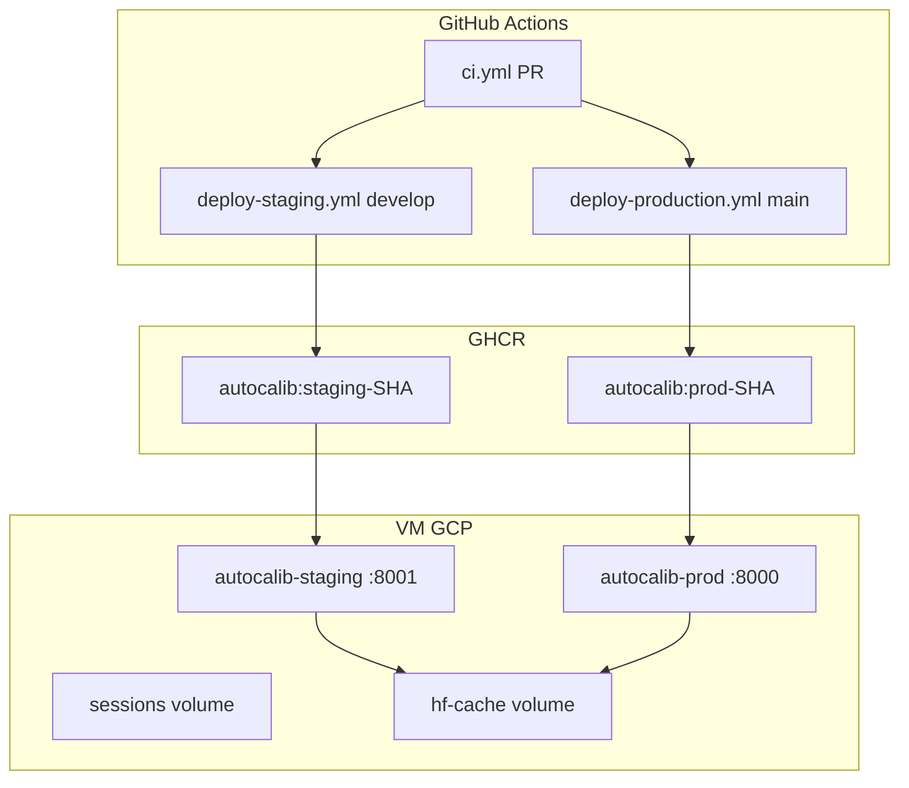

# Plan CI/CD autocalib — GitHub → VM GCP (Plan A Docker + GHCR)

> **Statut** : squelette implémenté dans le repo (juin 2026). Workflows **désactivés** — voir [README](./README.md).

## Recommandation retenue

**Plan A** — Docker + GHCR : la CI build/push l’image ; la VM pull + restart.  
**Staging** : même VM, port **8001**. **Prod** : port **8000**.

Plan B (git pull + systemd) documenté dans l’historique du plan Cursor ; non implémenté.

## Architecture cible

## Phases d’implémentation

| Phase | Contenu | Statut |
|-------|---------|--------|
| 0 | Squelette fichiers (workflows, compose prod, scripts, .env.example) | **Fait** |
| 1 | Repo GitHub + branches + protections | À faire |
| 2 | CI seule (`ci.yml` actif sur PR) | À faire |
| 3 | Infra VM (.env, dossiers, firewall) | À faire |
| 4 | GHCR + deploy staging | À faire |
| 5 | Deploy production + rollback | À faire |
| 6 | Remplacer skill `vm-rsync-build` par doc Actions | À faire |

## Fichiers créés (Phase 0)

- `.github/workflows/ci.yml`
- `.github/workflows/deploy-staging.yml`
- `.github/workflows/deploy-production.yml`
- `docker-compose.prod.yml`
- `scripts/deploy-vm.sh`
- `.env.example`, `.env.staging.example`
- `docs/deploy/README.md` (checklist)

## Non modifié (runtime actuel)

- `docker-compose.yml` — déploiement manuel rsync + build local sur VM
- `Dockerfile` — inchangé
